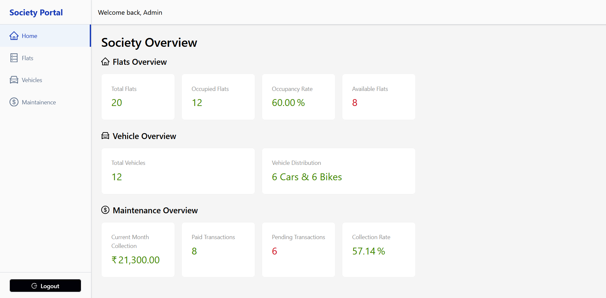
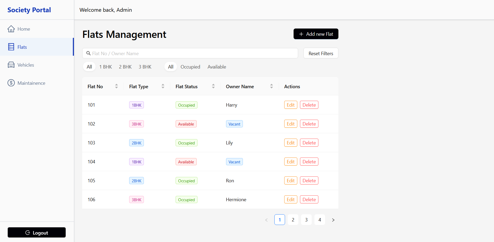
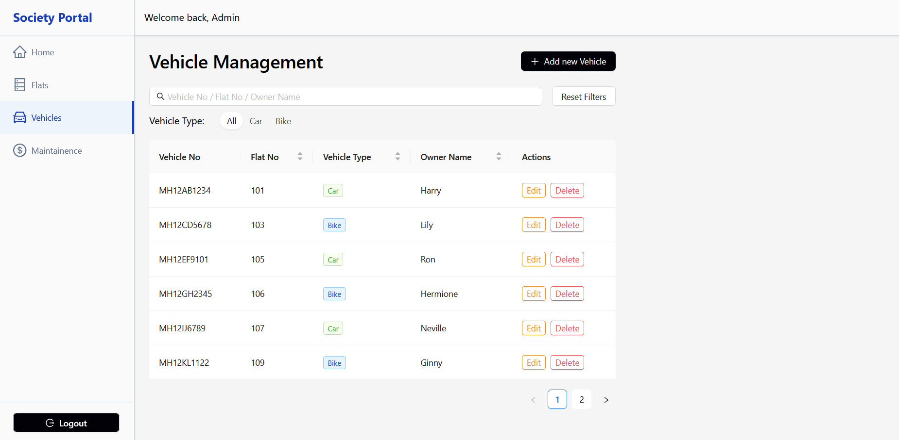
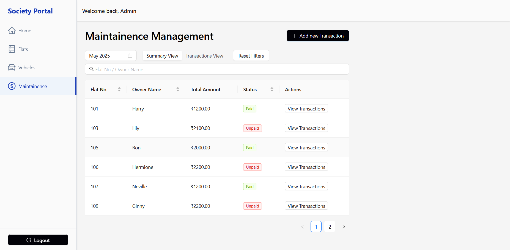

# 🏢 Society Management Dashboard

A modern web application designed to streamline the day-to-day operations of residential societies. With a focus on clarity, efficiency, and usability, this dashboard empowers society administrators to effortlessly manage flats, vehicles, maintenance records, and resident data.

---

## 🧩 Problem Statement

Residential societies face a variety of challenges in managing operational logistics, from occupancy tracking to maintenance collections. Relying on spreadsheets or manual logs leads to inefficiencies, human errors, and delayed responses.

This project aims to centralize and digitize all critical data for a residential society into a single, easy-to-use dashboard.

### Key Challenges Addressed:
- Monitoring total flats and occupancy types
- Tracking registered vehicles and their categories
- Managing maintenance payments and due dates
- Viewing owner/resident information
- Preventing duplicate records and ensuring data integrity

---

## ✨ Features

### 🔐 1. Authentication System
- Secure login and logout
- Route protection with persistent sessions
- Seamless state handling for authenticated users

### 🏠 2. Flats Management
- Add, edit, and view flat information
- Track occupancy and availability status
- Manage owner and resident details
- Categorize flats by type (e.g., 1BHK, 2BHK)
- View flat ownership and occupancy history

### 🚗 3. Vehicle Management
- Register and manage vehicles
- Support for vehicle categories (Bike/Car)
- Enforce uniqueness for vehicle numbers
- Track vehicle-to-owner mapping

### 💰 4. Maintenance Module
- Record and monitor payment status
- Support multiple payment modes (UPI, Cash, Card, Bank Transfer)
- Track maintenance amounts and due dates
- View payment history and receipts

### 📊 5. Dashboard & Statistics
- Real-time overview of society metrics
- Quick stats: total flats, occupied flats, vehicles, maintenance collected
- Clean and intuitive design
- Fully responsive layout (mobile, tablet, desktop)

---

## 🌐 Live Demo

You can access the live deployed version of the project here:  
🔗 **[Live Site](https://your-deployment-link.com)**


---

## 🖼️ Screenshots / Preview

> Below are preview images of the dashboard for a quick glance into the app:

### Dashboard Overview


### Flats Management


### Vehicle Management


### Maintenance Tracking


---

## 🛠 Tech Stack

### 🧑‍💻 Frontend
- **React 19** – Latest and optimized React version
- **TypeScript** – Strongly-typed development
- **Vite** – Blazing-fast bundler and dev server
- **Zustand** – Lightweight state management
- **React Router** – Declarative routing
- **Ant Design** – Elegant UI component library
- **Tailwind CSS** – Utility-first styling framework

### 🔧 Development Tools
- **ESLint** – Code quality and consistency
- **TypeScript** – Static type checking
- **Vite** – Fast build and hot module reload (HMR)

---

## 🚀 Getting Started

### 📦 Prerequisites
- [Node.js](https://nodejs.org/) (Latest LTS version recommended)
- npm or yarn

### ⚙️ Installation

1. **Clone the repository**
```bash
git clone https://github.com/your-username/society-dashboard.git
cd society-dashboard
```

2. **Install dependencies**
```bash
npm install
# or
yarn install
```

3. **Run the development server**
```bash
npm run dev
# or
yarn dev
```

4. **Build for production**
```bash
npm run build
# or
yarn build
```

---

<!-- ## 📌 Potential Enhancements *(Future Scope)*

> These features are under consideration or can be added based on future requirements:

- 🔐 Role-based access control
- 📦 Backend API & Database Integration
- 📨 Email/Push Notifications
- 📄 Data export (CSV, PDF)
- 📊 Advanced analytics dashboards
- 📂 Document & ID verification uploads
- 🧾 Resident self-service portal

--- -->

## 🤝 Contributing

Contributions are welcome! Follow these steps:

1. Fork the repository
2. Create a new branch:  
   `git checkout -b feature/YourFeatureName`
3. Commit your changes:  
   `git commit -m 'Add YourFeatureName'`
4. Push to your branch:  
   `git push origin feature/YourFeatureName`
5. Submit a pull request

---

## 🙏 Acknowledgments

- [Ant Design](https://ant.design/) for the UI components  
- [React](https://react.dev/) for the robust frontend framework  
- [Vite](https://vitejs.dev/) for the fast dev/build environment  
- [Tailwind CSS](https://tailwindcss.com/) for rapid UI development  
- All the open-source tools that made this project possible

---

## 👤 Author

**Devansh Singh Kushwah**  
Frontend & React Native Developer  
[LinkedIn](https://linkedin.com/in/devanshsk) • [GitHub](https://github.com/DevanshSK)

---